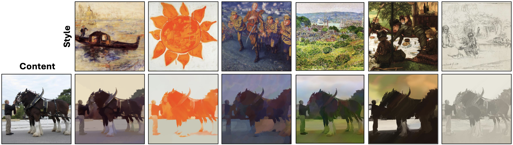

# PixelShuffler: A Simple Image Translation Through Pixel Rearrangement

<div align="center">
  
</div>

## Overview

**PixelShuffler** is a minimalist yet effective image-to-image translation method, demonstrated here in the context of style transfer. By shuffling pixels in the style image and maximizing mutual information between the shuffled image and the content image, PixelShuffler provides a computationally efficient alternative to complex neural architectures like GANs and diffusion models.

This repository contains the code, experiments, and results from the paper *PixelShuffler: A Simple Image Translation Through Pixel Rearrangement*. It demonstrates the method’s application to style transfer, though the underlying principles can be extended to other image-to-image translation tasks such as medical image translation.

## Key Features

- **Pixel Shuffle Algorithm**: Rearranges pixels in the target (style) image to adapt its visual characteristics while preserving the content structure from the source (contetn) image.
- **Mutual Information Maximization**: Ensures optimal blending of content and style without complex neural architectures and methodologies.
- **Efficient & Lightweight**: Achieves competitive results with significantly reduced computational complexity.

## Sample Result 

<div align="center">  </div>

## Installation

1. Clone the repository:
    ```bash
    git clone https://github.com/OmarSZamzam/PixelShuffler.git
    cd PixelShuffler
    ```

2. Install the required dependencies:
    ```bash
    pip install -r requirements.txt
    ```

## Usage

To run the PixelShuffler model for style transfer, you can specify several options, including the number of epochs, the loss functions to be minimized, and the desired size of the images. The arguments you can use are:

- `--content`: Path to the content image (required).
- `--style`: Path to the style image (required).
- `--losses`: Loss functions to minimize (optional, default: all). You can choose from:
  - `MI`: Mutual Information.
  - `LPIPS`: Learned Perceptual Image Patch Similarity.
  - `Style`: Style loss – to prioritize style preservation.
  Specify one or more loss functions as a space-separated list.
- `--epochs`: Number of epochs to run (optional, default: 1000).
- `--size`: Desired size of the images (optional, default: 512).

### Example

To run the style transfer with all default settings:
```bash
python style_transfer.py --content <path_to_content_image> --style <path_to_style_image>
```